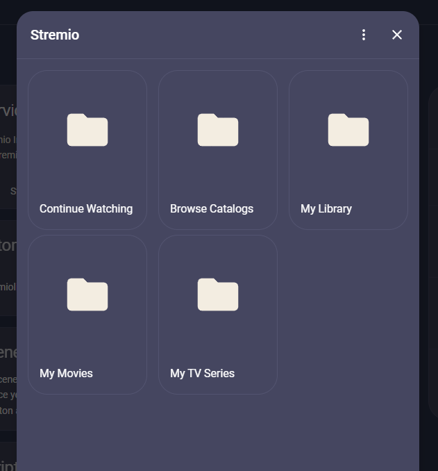
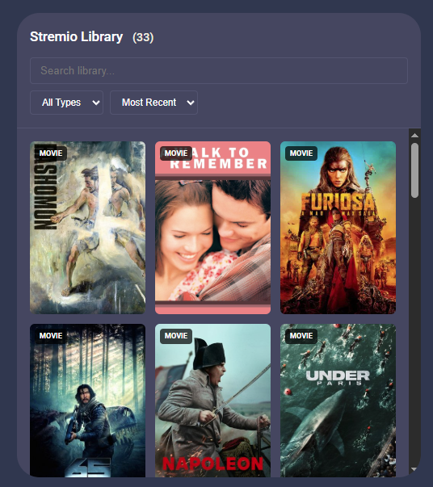
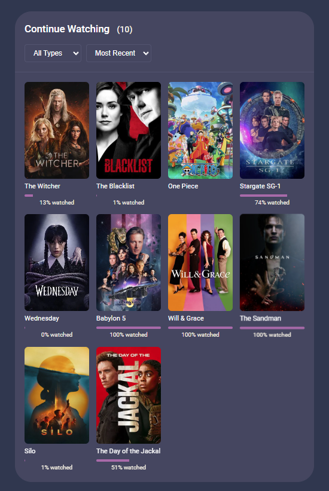
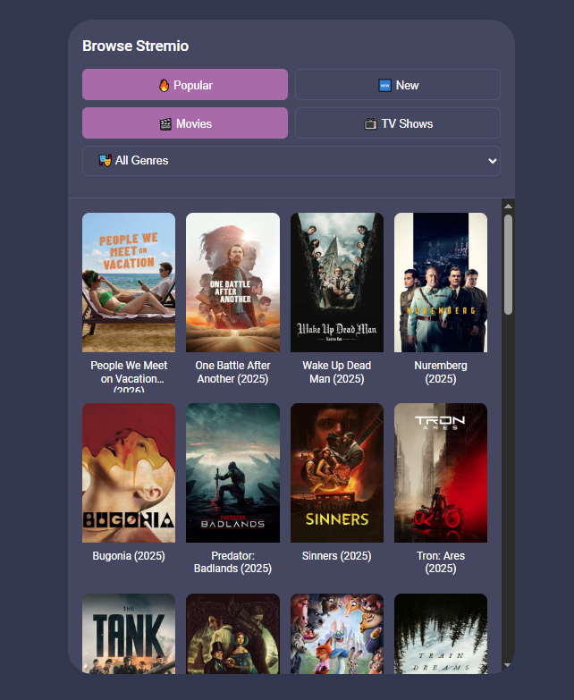
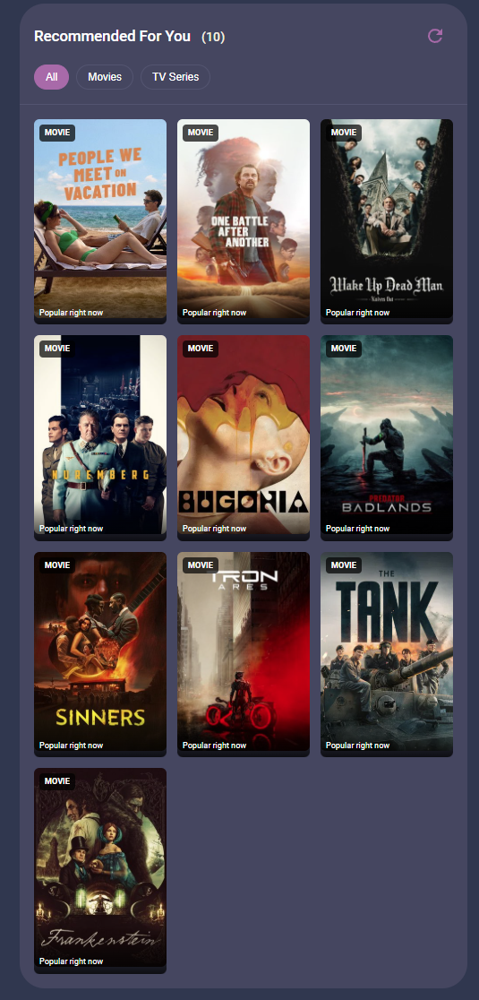

[HASS Community Forum Thread](https://community.home-assistant.io/t/stremio-integration-for-apple-tv/976514)
# Stremio Home Assistant Integration

[](https://github.com/hacs/integration)
[](https://github.com/tamaygz/hacs-stremio/releases)
[](LICENSE)
[](https://github.com/tamaygz/hacs-stremio/actions)

A comprehensive Home Assistant Custom Component (HACS) integration that connects to the Stremio API to track your library, viewing activity, and media consumption.

> **🍎 Built for Apple TV** — This integration was created primarily to bring easy Stremio playback to Apple TV using the VLC app. Stream your favorite content directly to your Apple TV with seamless AirPlay handover!

<p align="center">
  
</p>

---

## ✨ Features

| Feature                    | Description                                     |
| -------------------------- | ----------------------------------------------- |
| 🎬 **Media Player Entity** | Track current playback with rich metadata       |
| 📊 **Multiple Sensors**    | Library stats, watch time, current media        |
| 🔔 **Events**              | React to playback changes and library updates   |
| 📺 **Apple TV Handover**   | Stream content directly to Apple TV via AirPlay |
| 🎨 **Custom UI Cards**     | Beautiful Lovelace cards for library browsing   |
| 🔍 **Media Source**        | Browse library from HA media browser            |
| 🎯 **Services**            | Search, manage library, get stream URLs         |
| 🎭 **Catalog Browsing**    | Browse popular movies, TV shows, and by genre   |
| ⚙️ **Stream Preferences**  | Configure addon order & quality preferences     |

---

## 📦 Quick Start

### Installation via HACS

1. Open HACS → Integrations
2. Click ⋮ → Custom repositories
3. Add: `https://github.com/tamaygz/hacs-stremio` (Category: Integration)
4. Search "Stremio" → Install → Restart HA

### Configuration

1. Go to **Settings** → **Devices & Services** → **+ Add Integration**
2. Search **"Stremio"** → Enter credentials → Done!

📖 [Full Setup Guide](docs/setup.md)

---

## 🎯 Entities Created

### Sensors

| Entity                                   | Description             |
| ---------------------------------------- | ----------------------- |
| `sensor.stremio_current_media`           | Currently playing media |
| `sensor.stremio_last_watched`            | Last watched content    |
| `sensor.stremio_library_count`           | Total library items     |
| `sensor.stremio_continue_watching_count` | In-progress items       |

### Binary Sensors

| Entity                                      | Description                                |
| ------------------------------------------- | ------------------------------------------ |
| `binary_sensor.stremio_is_watching`         | On when media is currently being watched   |
| `binary_sensor.stremio_has_continue_watching` | On when there are items to continue watching |
| `binary_sensor.stremio_has_new_episodes`    | On when any series has unwatched episodes  |

### Media Player

| Entity                 | Description                      |
| ---------------------- | -------------------------------- |
| `media_player.stremio` | Playback state, metadata, poster |

### Media Source

Browse your entire Stremio library through Home Assistant's media browser:

<a href="docs/screenshots/media_browser_support.png">
  
</a>

---

## 🛠️ Services

```yaml
# Get stream URLs for a movie
service: stremio.get_stream_url
data:
  media_id: "tt0111161"
  media_type: "movie"

# Search your library
service: stremio.search_library
data:
  query: "Breaking Bad"

# Stream to Apple TV
service: stremio.handover_to_apple_tv
data:
  media_id: "tt0111161"
  device_name: "Living Room Apple TV"
  method: "airplay"

# Set currently watching
service: stremio.set_currently_watching
data:
  media_id: "tt0111161"
  media_type: "movie"
  progress: 120
  duration: 7200
```

📖 [Full Services Documentation](docs/services.md)

---

## 🎨 Custom Lovelace Cards

Cards are **auto-registered** - no manual setup needed!

### My Library Card

Browse and manage your Stremio library directly in Home Assistant.

```yaml
type: custom:stremio-library-card
title: My Library
```

<a href="docs/screenshots/card_my_library.png">
  
</a>

### Continue Watching Card

Keep track of shows and movies you're currently watching.

```yaml
type: custom:stremio-continue-watching-card
```

<a href="docs/screenshots/card_continue_watching.png">
  
</a>

### Browse Catalog Card

Explore popular and recommended content from various catalogs.

```yaml
type: custom:stremio-browse-catalog-card
```

<a href="docs/screenshots/card_browse_catalog.png">
  
</a>

### Recommended Media Card

Get personalized media recommendations.

```yaml
type: custom:stremio-recommended-media-card
```

<a href="docs/screenshots/card_recommended_media.png">
  
</a>

📖 [UI Cards Guide](docs/ui.md)

---

## 🚀 Automation Examples

```yaml
# Dim lights when watching
automation:
  - alias: "Cinema Mode"
    trigger:
      - platform: state
        entity_id: binary_sensor.stremio_is_playing
        to: "on"
    action:
      - service: light.turn_on
        target:
          entity_id: light.living_room
        data:
          brightness_pct: 10
```

📖 [More Examples](examples/)

---

## 📖 Documentation

| Guide                                      | Description                    |
| ------------------------------------------ | ------------------------------ |
| [Setup Guide](docs/setup.md)               | Installation & configuration   |
| [Configuration](docs/configuration.md)     | All options explained          |
| [Services](docs/services.md)               | Service calls & automation     |
| [Events](docs/events.md)                   | Event triggers for automations |
| [UI Cards](docs/ui.md)                     | Custom Lovelace cards          |
| [API Reference](docs/api.md)               | Developer documentation        |
| [Development](docs/development.md)         | Contributing guide             |
| [Troubleshooting](docs/troubleshooting.md) | Common issues                  |

---

## 🤝 Contributing

Contributions welcome! See [Development Guide](docs/development.md).

```bash
# Setup development environment
git clone https://github.com/tamaygz/hacs-stremio.git
cd hacs-stremio
pip install -r requirements_dev.txt

# Run tests
pytest tests/

# Run linters
black custom_components/stremio
flake8 custom_components/stremio
```

---

## 📝 License

MIT License - see [LICENSE](LICENSE) file.

## 🙏 Credits

- Native Stremio API integration using aiohttp
- Inspired by [@AboveColin's stremio-ha](https://github.com/AboveColin/stremio-ha)

## 💬 Support

- 🐛 [Report Issues](https://github.com/tamaygz/hacs-stremio/issues)
- 💬 [Discussions](https://github.com/tamaygz/hacs-stremio/discussions)

---

<p align="center">
  <b>⚠️ Not affiliated with Stremio. Use at your own risk.</b>
</p>

<p align="center">
  <b>Version 1.0.0</b> | <a href="CHANGELOG.md">Changelog</a>
</p>
